# Moveek Website - Pages Documentation
## Trang chủ (Home)
- **Đường dẫn:** `/`
- **Chức năng:**
  - Hiển thị giới thiệu tổng quan về website.
  - Gợi ý các nội dung nổi bật hoặc mới nhất.
  - Nút điều hướng đến các trang chính.

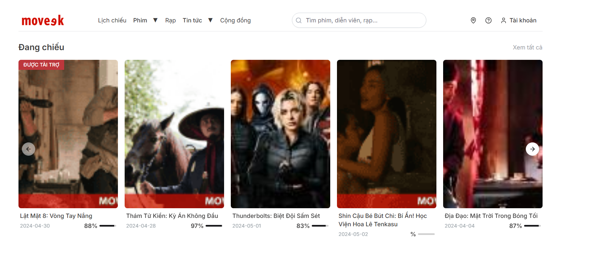
---

## Trang đăng nhập (Login)
- **Đường dẫn:** `/login` và `/admin/login`
- **Chức năng:**
  - Cho phép người dùng đăng nhập vào hệ thống.
  - Tích hợp xác thực (authentication).
  - Phân quyền người dùng nếu có (Admin/User).

- **Yêu cầu:**
  - Chưa có token user nào trong cookies
  - Đảm bảo xác thực quyền qua Api

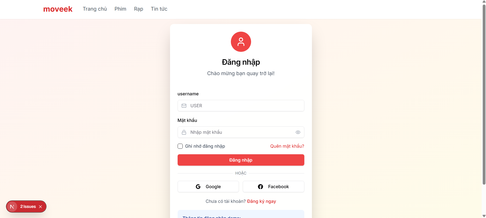
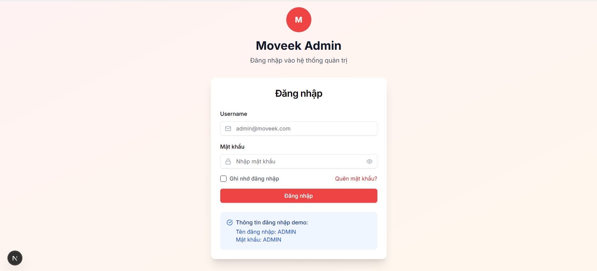
---

## Trang tổng quan quản trị(Dashboard Admin)

- **Đường dẫn:** `/admin/dashboard`

- **Chức năng:**
  -Cho phép quản trị viên có xem nội dung tổng quan của website(Số lượng phim, số lượng người dùng, số lượng rạp, số lượng đặt vé).

- **Yêu cầu:**
  - Đảm bảo dữ liệu được tải từ API hoặc database.

---

## Trang danh sách phim (Movies)

- **Đường dẫn:** `/admin/movies`
- **Chức năng:**
  - Danh sách phim đang chiếu, sắp chiếu.
  - Lọc phim theo thể loại, định dạng...
  - CRUD

- **Yêu cầu:**
  - Đảm bảo dữ liệu được tải từ API hoặc database.

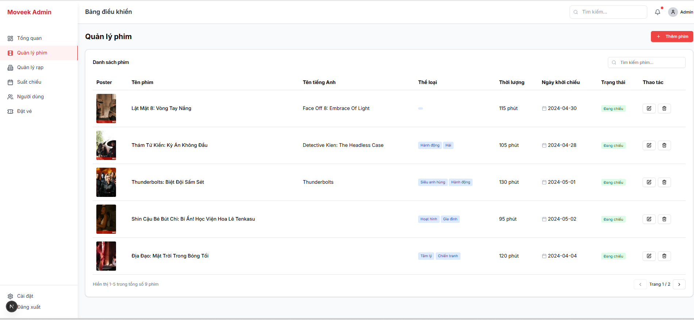

---

## Trang danh sách rạp (Theaters)

- **Đường dẫn:** `/admin/theaters`
- **Chức năng:**
  - Danh sách rạp phim.
  - Lọc rạp theo địa điểm, loại rạp...
  - CRUD

- **Yêu cầu:**
  - Đảm bảo dữ liệu được tải từ API hoặc database.

---

## Trang danh sách suất chiếu (Showtimes)

- **Đường dẫn:** `/admin/showtimes`
- **Chức năng:**
  - Danh sách suất chiếu phim.
  - Lọc suất chiếu theo ngày giờ, phim, rạp...
  - CRUD

- **Yêu cầu:**
  - Đảm bảo dữ liệu được tải từ API hoặc database.

---

## Trang danh sách người dùng (Users)

- **Đường dẫn:** `/admin/users`
- **Chức năng:**
  - Danh sách người dùng.
  - Lọc người dùng theo vai trò, trạng thái...

- **Yêu cầu:**
  - Đảm bảo dữ liệu được tải từ API hoặc database.

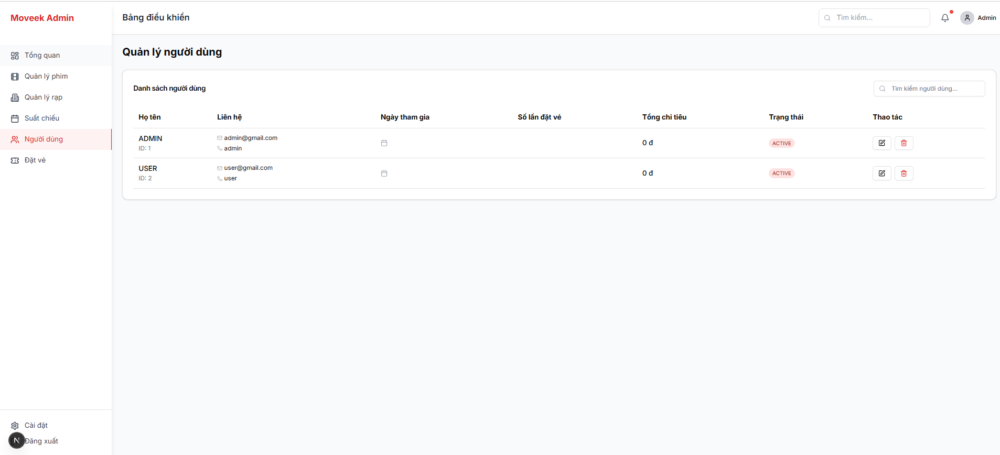
  
---
## Trang danh sách vé (Bookings)

- **Đường dẫn:** `/admin/bookings`
- **Chức năng:**
  - Danh sách vé đã đặt.
  - Lọc vé theo ngày giờ, phim, rạp...

- **Yêu cầu:**
  - Đảm bảo dữ liệu được tải từ API hoặc database.

---

## ⏰ Trang chọn suất chiếu phim (Showtime Selection)

- **Đường dẫn:** `/lich-chieu/[movieCode]`
- **Chức năng:**
  - Hiển thị danh sách các suất chiếu của một bộ phim đã chọn.
  - Người dùng có thể lọc theo:
    - Ngày chiếu (calendar picker).
    - Rạp chiếu (theater).
  - Khi chọn suất chiếu, người dùng sẽ được chuyển sang bước chọn ghế.

- **Yêu cầu:**
  - Đã chọn phim trước đó.
  - Đảm bảo suất chiếu được tải từ API hoặc database.

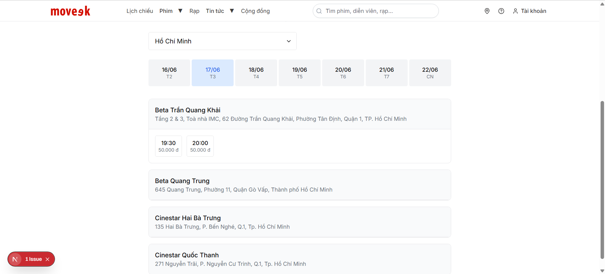

---

## Trang chọn ghế (Seat Selection)

- **Đường dẫn:** `/dat-ve/[showtimeId] (chế độ 1 của trang)
- **Chức năng:**
  - Hiển thị thông tin của suất chiếu.
  - Hiển thị sơ đồ ghế của phòng.
  - Khi chọn xong ghế, người dùng sẽ được chuyển sang bước nhập thông tin thanh toán.

- **Yêu cầu:**
  - Đã chọn suất chiếu trước đó.
  - Đảm bảo ghế được tải từ API hoặc database.

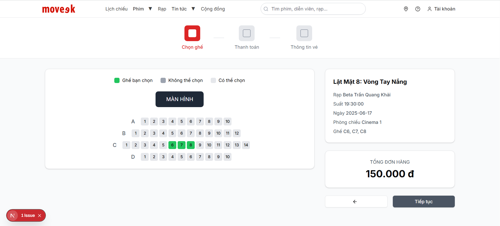

---

## Trang nhập thông tin thanh toán (Payment Method)

- **Đường dẫn:** `/dat-ve/[showtimeId]` (Chế độ 2 của trang)
- **Chức năng:**
  - Hiển thị thông tin vé và các ghế đã chọn.
  - Cho phép nhập thông tin thanh toán.
  - Tích hợp cổng thanh toán VNPay.
  - Tự động chuyển hướng người dùng đến trang cổng VNPAY để thanh toán.
  - Nhận callback từ VNPAY (sau khi người dùng thanh toán thành công/thất bại).
  - Hiển thị kết quả thanh toán cho người dùng.
- **Yêu cầu:**
  - Đơn hàng đã được khởi tạo và lưu tạm (pending).
  - Dữ liệu gửi đi đúng format của VNPAY (mã hóa, checksum, redirect URL,...).
  - Server/backend xử lý được response từ VNPAY và cập nhật trạng thái đơn hàng.
  - Đảm bảo bảo mật thông tin giao dịch.

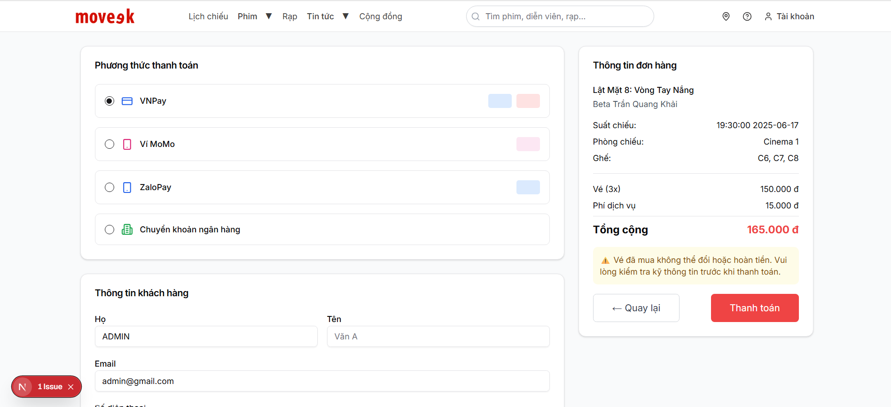
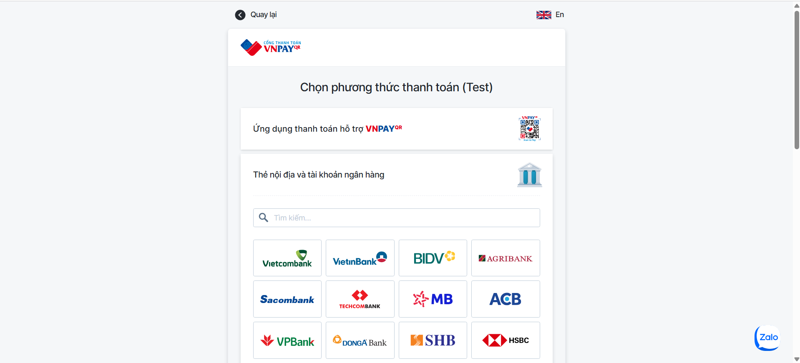
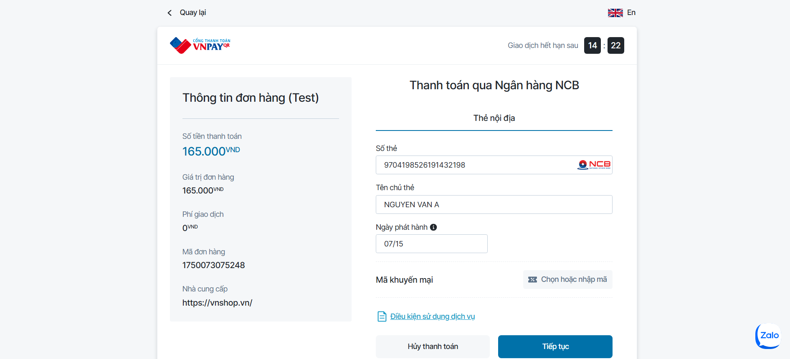

---

## Trang thông tin vé (Ticket Confirmation)

- **Đường dẫn:** `/thong-tin-ve/[bookingCode]`
- **Chức năng:**
  - Hiển thị thông tin vé và các ghế đã chọn.
  - Cho phép người dùng in vé hoặc tải về.
- **Yêu cầu:** Đơn hàng đã được thanh toán thành công.
- **Lưu ý:** Đảm bảo bảo mật thông tin giao dịch.

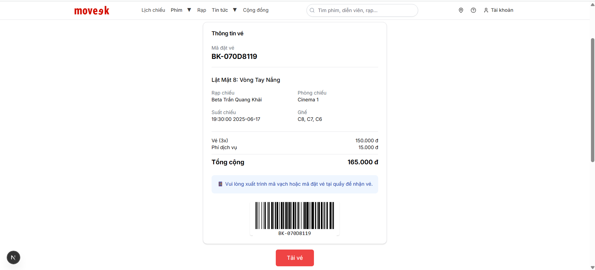

---

## Trang thông tin người dùng (User Profile)

- **Đường dẫn:** `/user/profile`
- **Chức năng:**
  - Hiển thị thông tin người dùng.
  - Cho phép người dùng cập nhật thông tin cá nhân.
  - Hiển thị lịch sử đặt vé của người dùng

- **Yêu cầu:** Người dùng đã đăng nhập.
- **Lưu ý:** Đảm bảo bảo mật thông tin cá nhân.

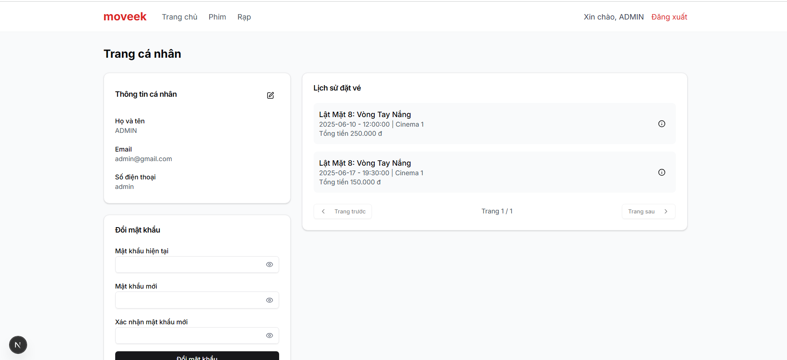